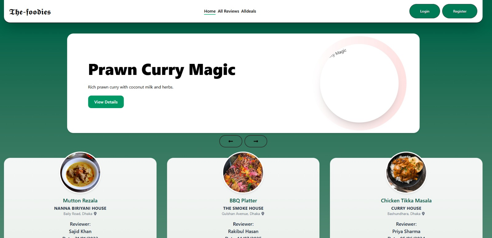

# 🍽️ The Foodies — Food Discovery & Review Platform

Live Website: https://the-foodies-heaven.netlify.app/

---

## 📌 Project Overview

The Foodies is a modern food discovery and review platform where users can explore delicious dishes, share their experiences, and save their favourite foods. The project focuses on providing a clean user interface, secure authentication, and a smooth user experience while demonstrating full-stack development skills.

This application allows authenticated users to manage reviews and favourites with real-time data handling and responsive design.

---

## 📸 Project Screenshot

Add a clean screenshot of the homepage or food listing page. Save the image as screenshot.png in the root directory.

---

## ✨ Key Features

- Secure user authentication using Firebase
- Add, edit, and manage food reviews
- Favourite system to save preferred dishes
- Search and filter dishes using backend logic
- Personalized “My Reviews” section
- Fully responsive UI for mobile, tablet, and desktop
- Smooth animations and clean design

---

## 🧰 Technologies Used

Frontend:
- React
- React Router
- Tailwind CSS
- GSAP

Backend:
- Node.js
- Express.js

Database:
- MongoDB Atlas

Authentication:
- Firebase Authentication

Deployment:
- Netlify (Frontend)
- Vercel (Backend)

---

## 📦 Main Dependencies

- react
- react-router-dom
- firebase
- axios
- gsap
- express
- mongodb

---

## ⚙️ How to Run the Project Locally

Step 1: Clone the repository  
git clone https://github.com/your-username/the-foodies.git  
cd the-foodies  

Step 2: Install dependencies  
npm install  

Step 3: Environment variables  
Create a .env file in the root directory and add:

VITE_FIREBASE_API_KEY=your_firebase_api_key  
VITE_FIREBASE_AUTH_DOMAIN=your_firebase_auth_domain  
MONGODB_URI=your_mongodb_connection_string  

Never commit the .env file to GitHub.

Step 4: Run the project  
npm run dev  

The application will run at: http://localhost:5173

---

## 🔗 Project Resources

Live Website: https://the-foodies-heaven.netlify.app/  
Frontend Repository: https://github.com/your-username/the-foodies  
Backend Repository: https://github.com/your-username/the-foodies-server  

---

## 🎯 Why This Project Matters

- Demonstrates real-world full-stack development
- Implements secure authentication
- Uses CRUD operations with MongoDB
- Focuses on clean UI/UX and responsiveness
- Built with modern, industry-relevant tools

---

## 👤 Author

Abdul Ali Sawan  
Full Stack MERN Developer  
Dhaka, Bangladesh  

Email: dev.abdulalisawan@gmail.com  
GitHub: https://github.com/Abdulalisawan  
LinkedIn: https://www.linkedin.com/in/abdul-ali-sawan  

---

## ✅ Programming Hero Requirement Checklist

Project overview provided: ✅  
Live project link included: ✅  
Screenshot included: ✅  
Technologies listed clearly: ✅  
Dependencies mentioned: ✅  
Core features highlighted: ✅  
Local setup guide included: ✅  
Resources section added: ✅  

---

⭐ If you like this project, consider giving it a star!
